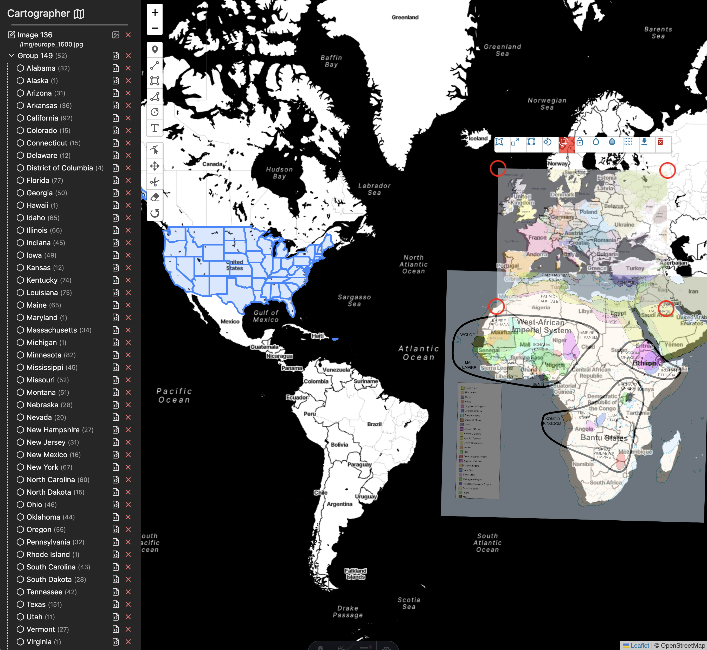

# carto



Trace geometry on transparent images (PNG,SVG) on maps (OSM), and save the shapes (GeoJSON).

Built with [Bun](https://bun.sh), [Astro](https://astro.build), [React](https://react.dev/),
[Zustand](https://github.com/pmndrs/zustand), and [Leaflet](https://leafletjs.com).

```shell
bun i
bunx --bun astro dev
```
